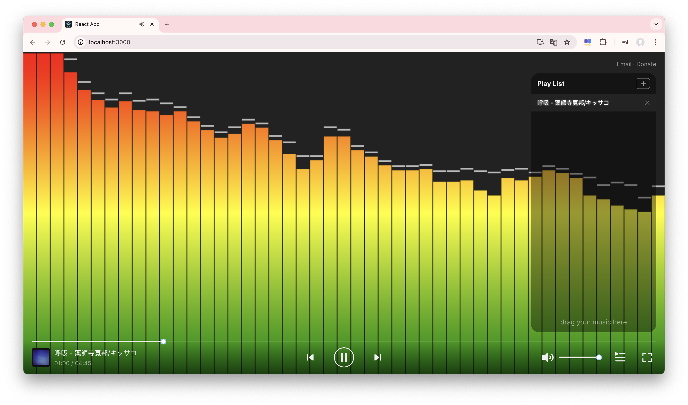

# Web Audio Visualizer

 - ReactJS
 - Audio API
 - jsmediatags-web : decodes mp3 to get music info (title, artist, cover image)

 - [react-color](https://casesandberg.github.io/react-color/)

 More and more visual effects are coming soon!

 Demo: [https://winters-song.github.io/audio-player/](https://winters-song.github.io/audio-player/)

 References:
 - [《爷青回！用原生 Audio API 实现一个千千静听》](https://zhuanlan.zhihu.com/p/479683217)

 - [stats.js by mrdoob](https://mrdoob.github.io/stats.js/build/stats.js)

